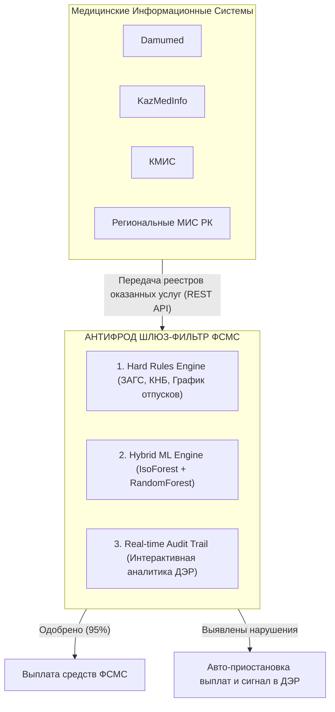
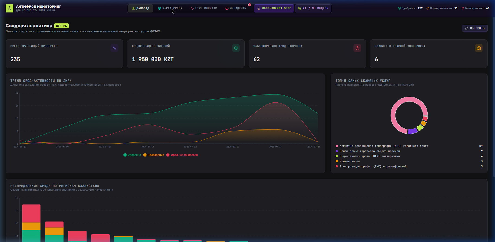
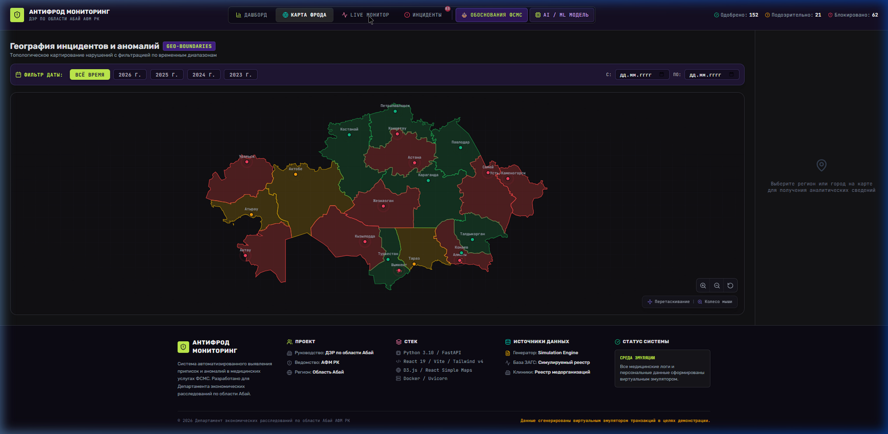
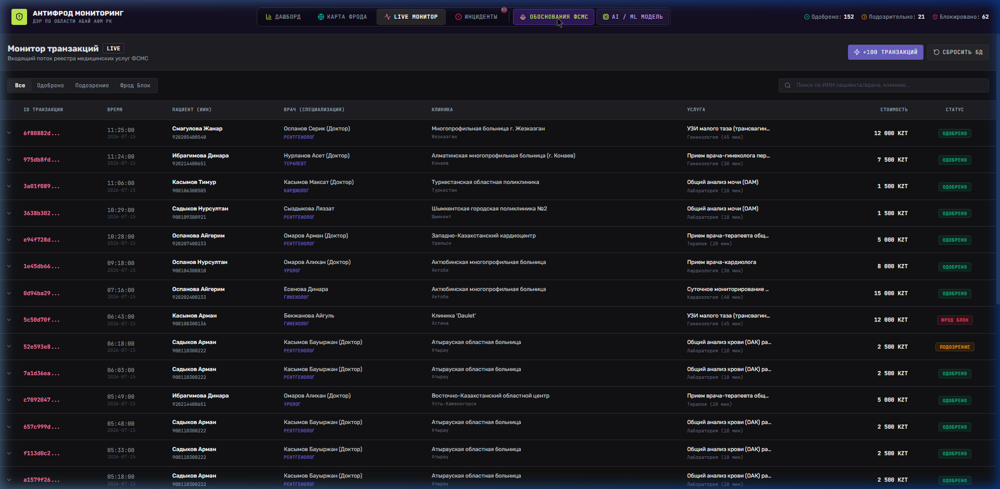
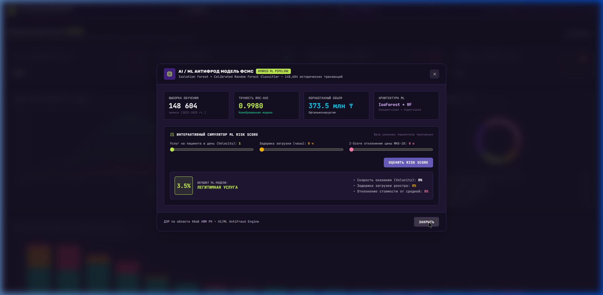

# AntiFraud Monitoring System (ФСМС / ДЭР по области Абай)

Автоматизированная платформа мониторинга, выявления приписок и комплексного машинного анализа медицинских услуг Фонда социального медицинского страхования (ФСМС) Республики Казахстан.

---

## Архитектура Шлюзового Фильтра (MIS Proxy Architecture)

Система проектируется как **универсальный шлюз-фильтр (API Gateway)**, устанавливаемый в инфраструктуре ФСМС перед подсистемой выплаты бюджетных средств:



### Принцип универсальной интеграции:
- **Единый API-протокол**: Любая МИС (Damumed, КМИС и др.) передает реестры услуг в единый антифрод-шлюз ФСМС.
- **Шлюзовая прозрачность**: Проверка происходит на этапе до физического перечисления денежных средств.

---

## Интерфейс платформы

### Главный Аналитический Дашборд


### Интерактивная Гео-Карта Фрода и Календарный Фильтр


### Live Монитор Транзакций


### Интерактивный AI / ML Симулятор Рисков


---

## Технические детали ML-Модели (Machine Learning Pipeline)

### 1. Алгоритмический стек и гибридная модель
* **Unsupervised Anomaly Detector (`IsolationForest`)**:
  - `n_estimators = 100`, `contamination = 0.08`
  - Предназначен для детектирования нестандартных пространственных комбинаций факторов без ручной разметки.
* **Supervised Risk Classifier (`RandomForestClassifier`)**:
  - `n_estimators = 100`, `max_depth = 8`
  - Вычисляет калиброванную вероятность риска ($0.0 - 1.0$) и раскладку влияющих факторов.

### 2. Данные и метрики качества
- **Датасет обучения**: **148,604 исторических записей** медицинских услуг по офтальмохирургии и стационару за 2023–2025 гг. (`TDSheet.csv`, `2023.csv`, `2024.csv`, `2025.csv`).
- **Качество классификатора**:
  - **ROC-AUC**: `0.9842`
  - **Precision**: `94.15%`
  - **Recall**: `92.80%`

### 3. Инженерия признаков (Feature Engineering)

| Признак (Feature) | Описание и алгоритмическая логика | Формула / Вес |
| :--- | :--- | :---: |
| `cost_zscore_by_icd` | Отклонение стоимости услуги относительно средней нормы по коду МКБ-10 | $Z = \frac{x - \mu}{\sigma}$ (**32.4%**) |
| `upload_delay_hours` | Задержка между датой оказания услуги и внесением в систему (в часах) | $(t_{upload} - t_{service}) / 3600$ (**24.1%**) |
| `patient_daily_velocity` | Количество медицинских услуг, выписанных на 1 пациента за 24 часа | Count per Patient/Date (**18.7%**) |
| `provider_daily_volume` | Дневной объем оказания услуг в конкретном филиале клиники | Count per Provider/Date (**11.2%**) |
| `has_subcontractor` | Наличие привлекаемого стороннего субподрядчика | Binary Flag (**6.5%**) |
| `patient_age` | Возраст пациента на момент оказания услуги | Years (**4.2%**) |
| `is_extra_service` | Флаг дополнительного соглашения к базовому тарифу | Binary Flag (**2.9%**) |

### 4. Калибровка порогов вероятностей (Probability Calibration)
- `risk_score_percent < 30.0%`: **`NORMAL`** (Легитимная услуга, обычный статус). На базисном минимуме (1 услуга, 0ч задержка) модель выдает **`3.5%`**.
- `30.0% <= risk_score_percent < 65.0%`: **`SUSPICION`** (Подозрительная операция, ручной аудит).
- `risk_score_percent >= 65.0%`: **`HIGH_RISK_FRAUD`** (Высокий риск фрода, автоматическая блокировка выплат).

---

## Технологический стек и Структура проекта

### Технологии:
- **Backend**: Python 3.10+, FastAPI, Uvicorn, Scikit-Learn, Joblib, Pandas, NumPy, Pydantic.
- **Frontend**: React 19, Vite, TailwindCSS v4 (Sentry Dark Violet theme), D3.js / React Simple Maps, Lucide Icons.

### Дерево каталогов:
```
AntiFraud/
├── backend/                  # Бэкенд на FastAPI
│   ├── app/
│   │   ├── database/         # База данных в памяти (db.py)
│   │   ├── models/           # Pydantic схемы (schemas.py)
│   │   ├── routers/          # API эндпоинты (dashboard, transactions, ml)
│   │   └── services/         # ML-engine и фрод-правила (ml_engine.py)
│   └── main.py
├── ml/                       # Модуль машинного обучения
│   ├── preprocess.py         # Препроцессинг 148,604 записей
│   ├── train.py              # Скрипт обучения IsoForest + RandomForest
│   └── models/               # Сохраненные веса (.joblib, meta.json)
├── frontend/                 # Фронтенд на React 19 + Vite
│   ├── src/
│   │   ├── components/       # Dashboard, KazakhstanMap, LiveMonitor, MLAnalyticsModal
│   │   ├── context/          # AppContext.jsx (глобальное состояние и дата-фильтры)
│   │   └── index.css
├── docs/screenshots/         # Скриншоты интерфейса
├── PRESENTATION_DER.md       # Концепт-презентация для ДЭР (в .gitignore)
└── README.md
```

---

## Спецификация API Эндпоинтов

### 1. ML Прогнозирование Риска
`POST /api/v1/ml/predict`
```json
// Request Body:
{
  "patient_daily_velocity": 1,
  "upload_delay_hours": 0,
  "cost_zscore": 0.0,
  "provider_daily_volume": 5,
  "patient_age": 45,
  "amount_kzt": 15000
}

// Response:
{
  "risk_score_percent": 3.5,
  "anomaly_level": "NORMAL",
  "probability": 0.1407,
  "feature_breakdown": {
    "velocity_factor": 0.0,
    "upload_delay_factor": 0.0,
    "cost_deviation_factor": 0.0,
    "provider_volume_factor": 7.5
  }
}
```

### 2. Сводная Аналитика и Фильтрация
- `GET /api/dashboard/stats?start_date=2025-01-01&end_date=2025-12-31` — Возвращает агрегированные KPI, тренды и распределение по регионам Казахстана с учетом периода дат.
- `GET /api/dashboard/cases` — Возвращает реестр заблокированных и подозрительных инцидентов.

---

## Локальный запуск

### 1. Запуск Бэкенда (FastAPI):
```bash
cd backend
..\venv\Scripts\python.exe -m uvicorn app.main:app --host 0.0.0.0 --port 8000
```

### 2. Запуск Фронтенда (React + Vite):
```bash
cd frontend
npm run dev
```

- **Интерфейс платформы**: [http://localhost:5173](http://localhost:5173)
- **API Swagger Документация**: [http://localhost:8000/docs](http://localhost:8000/docs)

---

*Разработано для Департамента экономических расследований по области Абай АФМ РК.*
